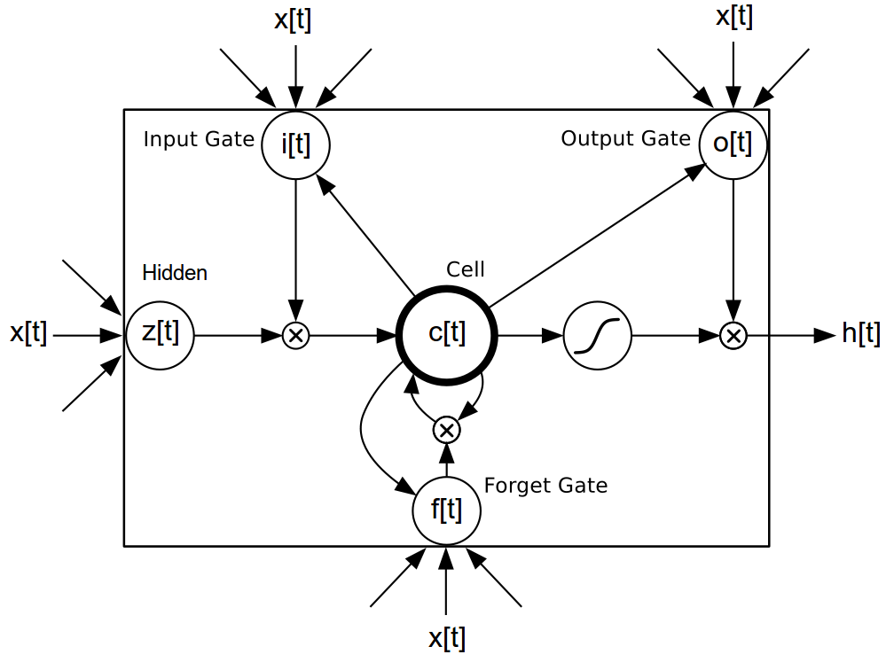
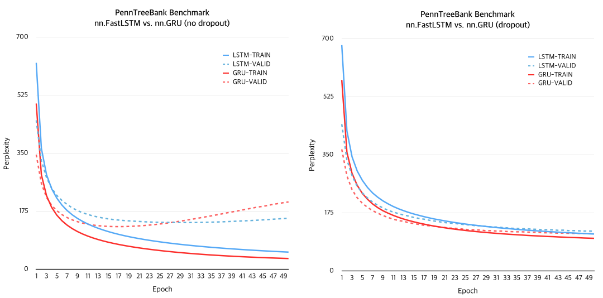
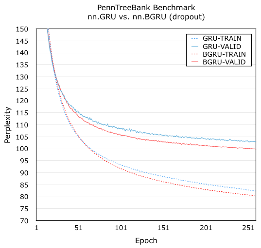
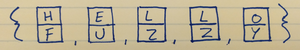
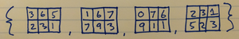
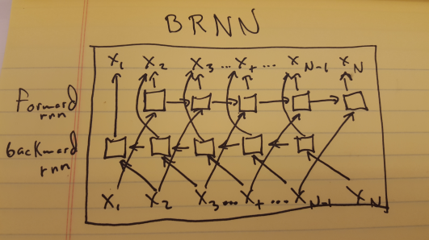

# rnn: recurrent neural networks #

This is a Recurrent Neural Network library that extends Torch's nn. 
You can use it to build RNNs, LSTMs, GRUs, BRNNs, BLSTMs, and so forth and so on.
This library includes documentation for the following objects:

Modules that consider successive calls to `forward` as different time-steps in a sequence :
 * [AbstractRecurrent](#rnn.AbstractRecurrent) : an abstract class inherited by Recurrent and LSTM;
 * [Recurrent](#rnn.Recurrent) : a generalized recurrent neural network container;
 * [LSTM](#rnn.LSTM) : a vanilla Long-Short Term Memory module;
  * [FastLSTM](#rnn.FastLSTM) : a faster [LSTM](#rnn.LSTM) with optional support for batch normalization;
 * [GRU](#rnn.GRU) : Gated Recurrent Units module;
 * [Recursor](#rnn.Recursor) : decorates a module to make it conform to the [AbstractRecurrent](#rnn.AbstractRecurrent) interface;
 * [Recurrence](#rnn.Recurrence) : decorates a module that outputs `output(t)` given `{input(t), output(t-1)}`;
 * [NormStabilizer](#rnn.NormStabilizer) : implements [norm-stabilization](http://arxiv.org/abs/1511.08400) criterion (add this module between RNNs);

Modules that `forward` entire sequences through a decorated `AbstractRecurrent` instance :
 * [AbstractSequencer](#rnn.AbstractSequencer) : an abstract class inherited by Sequencer, Repeater, RecurrentAttention, etc.;
 * [Sequencer](#rnn.Sequencer) : applies an encapsulated module to all elements in an input sequence  (Tensor or Table);
 * [SeqLSTM](#rnn.SeqLSTM) : a very fast version of `nn.Sequencer(nn.FastLSTM)` where the `input` and `output` are tensors;
 * [SeqGRU](#rnn.SeqGRU) : a very fast version of `nn.Sequencer(nn.GRU)` where the `input` and `output` are tensors;
 * [SeqBRNN](#rnn.SeqBRNN) : Bidirectional RNN based on SeqLSTM;
 * [BiSequencer](#rnn.BiSequencer) : used for implementing Bidirectional RNNs and LSTMs;
 * [BiSequencerLM](#rnn.BiSequencerLM) : used for implementing Bidirectional RNNs and LSTMs for language models;
 * [Repeater](#rnn.Repeater) : repeatedly applies the same input to an AbstractRecurrent instance;
 * [RecurrentAttention](#rnn.RecurrentAttention) : a generalized attention model for [REINFORCE modules](https://github.com/nicholas-leonard/dpnn#nn.Reinforce);

Miscellaneous modules and criterions :
 * [MaskZero](#rnn.MaskZero) : zeroes the `output` and `gradOutput` rows of the decorated module for commensurate `input` rows which are tensors of zeros;
 * [TrimZero](#rnn.TrimZero) : same behavior as `MaskZero`, but more efficient when `input` contains lots zero-masked rows;
 * [LookupTableMaskZero](#rnn.LookupTableMaskZero) : extends `nn.LookupTable` to support zero indexes for padding. Zero indexes are forwarded as tensors of zeros;
 * [MaskZeroCriterion](#rnn.MaskZeroCriterion) : zeros the `gradInput` and `err` rows of the decorated criterion for commensurate `input` rows which are tensors of zeros;
 * [SeqReverseSequence](#rnn.SeqReverseSequence) : reverses an input sequence on a specific dimension;

Criterions used for handling sequential inputs and targets :
 * [SequencerCriterion](#rnn.SequencerCriterion) : sequentially applies the same criterion to a sequence of inputs and targets (Tensor or Table).
 * [RepeaterCriterion](#rnn.RepeaterCriterion) : repeatedly applies the same criterion with the same target on a sequence.


<a name='rnn.examples'></a>
## Examples ##

The following are example training scripts using this package :

  * [RNN/LSTM/GRU](examples/recurrent-language-model.lua) for Penn Tree Bank dataset;
  * [Noise Contrastive Estimate](examples/noise-contrastive-estimate.lua) for training multi-layer [SeqLSTM](#rnn.SeqLSTM) language models on the [Google Billion Words dataset](https://github.com/Element-Research/dataload#dl.loadGBW). The example uses [MaskZero](#rnn.MaskZero) to train independent variable length sequences using the [NCEModule](https://github.com/Element-Research/dpnn#nn.NCEModule) and [NCECriterion](https://github.com/Element-Research/dpnn#nn.NCECriterion). This script is our fastest yet boasting speeds of 20,000 words/second (on NVIDIA Titan X) with a 2-layer LSTM having 250 hidden units, a batchsize of 128 and sequence length of a 100. Note that you will need to have [Torch installed with Lua instead of LuaJIT](http://torch.ch/docs/getting-started.html#_);
  * [Recurrent Model for Visual Attention](examples/recurrent-visual-attention.lua) for the MNIST dataset;
  * [Encoder-Decoder LSTM](examples/encoder-decoder-coupling.lua) shows you how to couple encoder and decoder `LSTMs` for sequence-to-sequence networks;
  * [Simple Recurrent Network](examples/simple-recurrent-network.lua) shows a simple example for building and training a simple recurrent neural network;
  * [Simple Sequencer Network](examples/simple-recurrent-network.lua) is a version of the above script that uses the Sequencer to decorate the `rnn` instead;
  * [Sequence to One](examples/sequence-to-one.lua) demonstrates how to do many to one sequence learning as is the case for sentiment analysis;
  * [Multivariate Time Series](examples/recurrent-time-series.lua) demonstrates how train a simple RNN to do multi-variate time-series predication.

### External Resources

  * [rnn-benchmarks](https://github.com/glample/rnn-benchmarks) : benchmarks comparing Torch (using this library), Theano and TensorFlow.
  * [Harvard Jupyter Notebook Tutorial](http://nbviewer.jupyter.org/github/CS287/Lectures/blob/gh-pages/notebooks/ElementRNNTutorial.ipynb) : an in-depth tutorial for how to use the Element-Research rnn package by Harvard University;
  * [dpnn](https://github.com/Element-Research/dpnn) : this is a dependency of the __rnn__ package. It contains useful nn extensions, modules and criterions;
  * [dataload](https://github.com/Element-Research/dataload) : a collection of torch dataset loaders;
  * [RNN/LSTM/BRNN/BLSTM training script ](https://github.com/nicholas-leonard/dp/blob/master/examples/recurrentlanguagemodel.lua) for Penn Tree Bank or Google Billion Words datasets;
  * A brief (1 hours) overview of Torch7, which includes some details about the __rnn__ packages (at the end), is available via this [NVIDIA GTC Webinar video](http://on-demand.gputechconf.com/gtc/2015/webinar/torch7-applied-deep-learning-for-vision-natural-language.mp4). In any case, this presentation gives a nice overview of Logistic Regression, Multi-Layer Perceptrons, Convolutional Neural Networks and Recurrent Neural Networks using Torch7;
  * [Sequence to Sequence mapping using encoder-decoder RNNs](https://github.com/rahul-iisc/seq2seq-mapping) : a complete training example using synthetic data.
  * [ConvLSTM](https://github.com/viorik/ConvLSTM) is a repository for training a [Spatio-temporal video autoencoder with differentiable memory](http://arxiv.org/abs/1511.06309).
  * An [time series example](https://github.com/rracinskij/rnntest01/blob/master/rnntest01.lua) for univariate timeseries prediction.
  
## Citation ##

If you use __rnn__ in your work, we'd really appreciate it if you could cite the following paper:

Léonard, Nicholas, Sagar Waghmare, Yang Wang, and Jin-Hwa Kim. [rnn: Recurrent Library for Torch.](http://arxiv.org/abs/1511.07889) arXiv preprint arXiv:1511.07889 (2015).

Any significant contributor to the library will also get added as an author to the paper.
A [significant contributor](https://github.com/Element-Research/rnn/graphs/contributors) 
is anyone who added at least 300 lines of code to the library.

## Troubleshooting ##

Most issues can be resolved by updating the various dependencies:
```bash
luarocks install torch
luarocks install nn
luarocks install dpnn
luarocks install torchx
```

If you are using CUDA :
```bash
luarocks install cutorch
luarocks install cunn
luarocks install cunnx
```

And don't forget to update this package :
```bash
luarocks install rnn
```

If that doesn't fix it, open and issue on github.

<a name='rnn.AbstractRecurrent'></a>
## AbstractRecurrent ##
An abstract class inherited by [Recurrent](#rnn.Recurrent), [LSTM](#rnn.LSTM) and [GRU](#rnn.GRU).
The constructor takes a single argument :
```lua
rnn = nn.AbstractRecurrent([rho])
```
Argument `rho` is the maximum number of steps to backpropagate through time (BPTT).
Sub-classes can set this to a large number like 99999 (the default) if they want to backpropagate through 
the entire sequence whatever its length. Setting lower values of rho are 
useful when long sequences are forward propagated, but we only whish to 
backpropagate through the last `rho` steps, which means that the remainder 
of the sequence doesn't need to be stored (so no additional cost). 

### [recurrentModule] getStepModule(step) ###
Returns a module for time-step `step`. This is used internally by sub-classes 
to obtain copies of the internal `recurrentModule`. These copies share 
`parameters` and `gradParameters` but each have their own `output`, `gradInput` 
and any other intermediate states. 

### setOutputStep(step) ###
This is a method reserved for internal use by [Recursor](#rnn.Recursor) 
when doing backward propagation. It sets the object's `output` attribute
to point to the output at time-step `step`. 
This method was introduced to solve a very annoying bug.

### maskZero(nInputDim) ###
Decorates the internal `recurrentModule` with [MaskZero](#rnn.MaskZero). 
The `output` Tensor (or table thereof) of the `recurrentModule`
will have each row (i.e. samples) zeroed when the commensurate row of the `input` 
is a tensor of zeros. 

The `nInputDim` argument must specify the number of non-batch dims 
in the first Tensor of the `input`. In the case of an `input` table,
the first Tensor is the first one encountered when doing a depth-first search.

Calling this method makes it possible to pad sequences with different lengths in the same batch with zero vectors.

When a sample time-step is masked (i.e. `input` is a row of zeros), then 
the hidden state is effectively reset (i.e. forgotten) for the next non-mask time-step.
In other words, it is possible seperate unrelated sequences with a masked element.

### trimZero(nInputDim) ###
Decorates the internal `recurrentModule` with [TrimZero](#rnn.TrimZero). 

### [output] updateOutput(input) ###
Forward propagates the input for the current step. The outputs or intermediate 
states of the previous steps are used recurrently. This is transparent to the 
caller as the previous outputs and intermediate states are memorized. This 
method also increments the `step` attribute by 1.

<a name='rnn.AbstractRecurrent.updateGradInput'></a>
### updateGradInput(input, gradOutput) ###
Like `backward`, this method should be called in the reverse order of 
`forward` calls used to propagate a sequence. So for example :

```lua
rnn = nn.LSTM(10, 10) -- AbstractRecurrent instance
local outputs = {}
for i=1,nStep do -- forward propagate sequence
   outputs[i] = rnn:forward(inputs[i])
end

for i=nStep,1,-1 do -- backward propagate sequence in reverse order
   gradInputs[i] = rnn:backward(inputs[i], gradOutputs[i])
end

rnn:forget()
``` 

The reverse order implements backpropagation through time (BPTT).

### accGradParameters(input, gradOutput, scale) ###
Like `updateGradInput`, but for accumulating gradients w.r.t. parameters.

### recycle(offset) ###
This method goes hand in hand with `forget`. It is useful when the current
time-step is greater than `rho`, at which point it starts recycling 
the oldest `recurrentModule` `sharedClones`, 
such that they can be reused for storing the next step. This `offset` 
is used for modules like `nn.Recurrent` that use a different module 
for the first step. Default offset is 0.

<a name='rnn.AbstractRecurrent.forget'></a>
### forget(offset) ###
This method brings back all states to the start of the sequence buffers, 
i.e. it forgets the current sequence. It also resets the `step` attribute to 1.
It is highly recommended to call `forget` after each parameter update. 
Otherwise, the previous state will be used to activate the next, which 
will often lead to instability. This is caused by the previous state being
the result of now changed parameters. It is also good practice to call 
`forget` at the start of each new sequence.

<a name='rnn.AbstractRecurrent.maxBPTTstep'></a>
###  maxBPTTstep(rho) ###
This method sets the maximum number of time-steps for which to perform 
backpropagation through time (BPTT). So say you set this to `rho = 3` time-steps,
feed-forward for 4 steps, and then backpropgate, only the last 3 steps will be 
used for the backpropagation. If your AbstractRecurrent instance is wrapped 
by a [Sequencer](#rnn.Sequencer), this will be handled auto-magically by the Sequencer.
Otherwise, setting this value to a large value (i.e. 9999999), is good for most, if not all, cases.

<a name='rnn.AbstractRecurrent.backwardOnline'></a>
### backwardOnline() ###
This method was deprecated Jan 6, 2016. 
Since then, by default, `AbstractRecurrent` instances use the 
backwardOnline behaviour. 
See [updateGradInput](#rnn.AbstractRecurrent.updateGradInput) for details.

### training() ###
In training mode, the network remembers all previous `rho` (number of time-steps)
states. This is necessary for BPTT. 

### evaluate() ###
During evaluation, since their is no need to perform BPTT at a later time, 
only the previous step is remembered. This is very efficient memory-wise, 
such that evaluation can be performed using potentially infinite-length 
sequence.
 
<a name='rnn.Recurrent'></a>
## Recurrent ##
References :
 * A. [Sutsekever Thesis Sec. 2.5 and 2.8](http://www.cs.utoronto.ca/~ilya/pubs/ilya_sutskever_phd_thesis.pdf)
 * B. [Mikolov Thesis Sec. 3.2 and 3.3](http://www.fit.vutbr.cz/~imikolov/rnnlm/thesis.pdf)
 * C. [RNN and Backpropagation Guide](http://citeseerx.ist.psu.edu/viewdoc/download?doi=10.1.1.3.9311&rep=rep1&type=pdf)

A [composite Module](https://github.com/torch/nn/blob/master/doc/containers.md#containers) for implementing Recurrent Neural Networks (RNN), excluding the output layer. 

The `nn.Recurrent(start, input, feedback, [transfer, rho, merge])` constructor takes 6 arguments:
 * `start` : the size of the output (excluding the batch dimension), or a Module that will be inserted between the `input` Module and `transfer` module during the first step of the propagation. When `start` is a size (a number or `torch.LongTensor`), then this *start* Module will be initialized as `nn.Add(start)` (see Ref. A).
 * `input` : a Module that processes input Tensors (or Tables). Output must be of same size as `start` (or its output in the case of a `start` Module), and same size as the output of the `feedback` Module.
 * `feedback` : a Module that feedbacks the previous output Tensor (or Tables) up to the `transfer` Module.
 * `transfer` : a non-linear Module used to process the element-wise sum of the `input` and `feedback` module outputs, or in the case of the first step, the output of the *start* Module.
 * `rho` : the maximum amount of backpropagation steps to take back in time. Limits the number of previous steps kept in memory. Due to the vanishing gradients effect, references A and B recommend `rho = 5` (or lower). Defaults to 99999.
 * `merge` : a [table Module](https://github.com/torch/nn/blob/master/doc/table.md#table-layers) that merges the outputs of the `input` and `feedback` Module before being forwarded through the `transfer` Module.
 
An RNN is used to process a sequence of inputs. 
Each step in the sequence should be propagated by its own `forward` (and `backward`), 
one `input` (and `gradOutput`) at a time. 
Each call to `forward` keeps a log of the intermediate states (the `input` and many `Module.outputs`) 
and increments the `step` attribute by 1. 
Method `backward` must be called in reverse order of the sequence of calls to `forward` in 
order to backpropgate through time (BPTT). This reverse order is necessary 
to return a `gradInput` for each call to `forward`. 

The `step` attribute is only reset to 1 when a call to the `forget` method is made. 
In which case, the Module is ready to process the next sequence (or batch thereof).
Note that the longer the sequence, the more memory that will be required to store all the 
`output` and `gradInput` states (one for each time step). 

To use this module with batches, we suggest using different 
sequences of the same size within a batch and calling `updateParameters` 
every `rho` steps and `forget` at the end of the sequence. 

Note that calling the `evaluate` method turns off long-term memory; 
the RNN will only remember the previous output. This allows the RNN 
to handle long sequences without allocating any additional memory.


For a simple concise example of how to make use of this module, please consult the 
[simple-recurrent-network.lua](examples/simple-recurrent-network.lua)
training script.

<a name='rnn.Recurrent.Sequencer'></a>
### Decorate it with a Sequencer ###

Note that any `AbstractRecurrent` instance can be decorated with a [Sequencer](#rnn.Sequencer) 
such that an entire sequence (a table) can be presented with a single `forward/backward` call.
This is actually the recommended approach as it allows RNNs to be stacked and makes the 
rnn conform to the Module interface, i.e. each call to `forward` can be 
followed by its own immediate call to `backward` as each `input` to the 
model is an entire sequence, i.e. a table of tensors where each tensor represents
a time-step.

```lua
seq = nn.Sequencer(module)
```

The [simple-sequencer-network.lua](examples/simple-sequencer-network.lua) training script
is equivalent to the above mentionned [simple-recurrent-network.lua](examples/simple-recurrent-network.lua)
script, except that it decorates the `rnn` with a `Sequencer` which takes 
a table of `inputs` and `gradOutputs` (the sequence for that batch).
This lets the `Sequencer` handle the looping over the sequence.

You should only think about using the `AbstractRecurrent` modules without 
a `Sequencer` if you intend to use it for real-time prediction. 
Actually, you can even use an `AbstractRecurrent` instance decorated by a `Sequencer`
for real time prediction by calling `Sequencer:remember()` and presenting each 
time-step `input` as `{input}`.

Other decorators can be used such as the [Repeater](#rnn.Repeater) or [RecurrentAttention](#rnn.RecurrentAttention).
The `Sequencer` is only the most common one. 

<a name='rnn.LSTM'></a>
## LSTM ##
References :
 * A. [Speech Recognition with Deep Recurrent Neural Networks](http://arxiv.org/pdf/1303.5778v1.pdf)
 * B. [Long-Short Term Memory](http://web.eecs.utk.edu/~itamar/courses/ECE-692/Bobby_paper1.pdf)
 * C. [LSTM: A Search Space Odyssey](http://arxiv.org/pdf/1503.04069v1.pdf)
 * D. [nngraph LSTM implementation on github](https://github.com/wojzaremba/lstm)

This is an implementation of a vanilla Long-Short Term Memory module. 
We used Ref. A's LSTM as a blueprint for this module as it was the most concise.
Yet it is also the vanilla LSTM described in Ref. C. 

The `nn.LSTM(inputSize, outputSize, [rho])` constructor takes 3 arguments:
 * `inputSize` : a number specifying the size of the input;
 * `outputSize` : a number specifying the size of the output;
 * `rho` : the maximum amount of backpropagation steps to take back in time. Limits the number of previous steps kept in memory. Defaults to 9999.

 

The actual implementation corresponds to the following algorithm:
```lua
i[t] = σ(W[x->i]x[t] + W[h->i]h[t−1] + W[c->i]c[t−1] + b[1->i])      (1)
f[t] = σ(W[x->f]x[t] + W[h->f]h[t−1] + W[c->f]c[t−1] + b[1->f])      (2)
z[t] = tanh(W[x->c]x[t] + W[h->c]h[t−1] + b[1->c])                   (3)
c[t] = f[t]c[t−1] + i[t]z[t]                                         (4)
o[t] = σ(W[x->o]x[t] + W[h->o]h[t−1] + W[c->o]c[t] + b[1->o])        (5)
h[t] = o[t]tanh(c[t])                                                (6)
```
where `W[s->q]` is the weight matrix from `s` to `q`, `t` indexes the time-step,
`b[1->q]` are the biases leading into `q`, `σ()` is `Sigmoid`, `x[t]` is the input,
`i[t]` is the input gate (eq. 1), `f[t]` is the forget gate (eq. 2), 
`z[t]` is the input to the cell (which we call the hidden) (eq. 3), 
`c[t]` is the cell (eq. 4), `o[t]` is the output gate (eq. 5), 
and `h[t]` is the output of this module (eq. 6). Also note that the 
weight matrices from cell to gate vectors are diagonal `W[c->s]`, where `s` 
is `i`,`f`, or `o`.

As you can see, unlike [Recurrent](#rnn.Recurrent), this 
implementation isn't generic enough that it can take arbitrary component Module
definitions at construction. However, the LSTM module can easily be adapted 
through inheritance by overriding the different factory methods :
  * `buildGate` : builds generic gate that is used to implement the input, forget and output gates;
  * `buildInputGate` : builds the input gate (eq. 1). Currently calls `buildGate`;
  * `buildForgetGate` : builds the forget gate (eq. 2). Currently calls `buildGate`;
  * `buildHidden` : builds the hidden (eq. 3);
  * `buildCell` : builds the cell (eq. 4);
  * `buildOutputGate` : builds the output gate (eq. 5). Currently calls `buildGate`;
  * `buildModel` : builds the actual LSTM model which is used internally (eq. 6).
  
Note that we recommend decorating the `LSTM` with a `Sequencer` 
(refer to [this](#rnn.Recurrent.Sequencer) for details).
  
<a name='rnn.FastLSTM'></a>
## FastLSTM ##

A faster version of the [LSTM](#rnn.LSTM). 
Basically, the input, forget and output gates, as well as the hidden state are computed at one fellswoop.

Note that `FastLSTM` does not use peephole connections between cell and gates. The algorithm from `LSTM` changes as follows:
```lua
i[t] = σ(W[x->i]x[t] + W[h->i]h[t−1] + b[1->i])                      (1)
f[t] = σ(W[x->f]x[t] + W[h->f]h[t−1] + b[1->f])                      (2)
z[t] = tanh(W[x->c]x[t] + W[h->c]h[t−1] + b[1->c])                   (3)
c[t] = f[t]c[t−1] + i[t]z[t]                                         (4)
o[t] = σ(W[x->o]x[t] + W[h->o]h[t−1] + b[1->o])                      (5)
h[t] = o[t]tanh(c[t])                                                (6)
```
i.e. omitting the summands `W[c->i]c[t−1]` (eq. 1), `W[c->f]c[t−1]` (eq. 2), and `W[c->o]c[t]` (eq. 5).

### usenngraph ###
This is a static attribute of the `FastLSTM` class. The default value is `false`.
Setting `usenngraph = true` will force all new instantiated instances of `FastLSTM` 
to use `nngraph`'s `nn.gModule` to build the internal `recurrentModule` which is 
cloned for each time-step.

<a name='rnn.FastLSTM.bn'></a>
#### Recurrent Batch Normalization ####

This extends the `FastLSTM` class to enable faster convergence during training by zero-centering the input-to-hidden and hidden-to-hidden transformations. 
It reduces the [internal covariate shift](https://arXiv.org/1502.03167v3) between time steps. It is an implementation of Cooijmans et. al.'s [Recurrent Batch Normalization](https://arxiv.org/1603.09025). The hidden-to-hidden transition of each LSTM cell is normalized according to 
```lua
i[t] = σ(BN(W[x->i]x[t]) + BN(W[h->i]h[t−1]) + b[1->i])                      (1)
f[t] = σ(BN(W[x->f]x[t]) + BN(W[h->f]h[t−1]) + b[1->f])                      (2)
z[t] = tanh(BN(W[x->c]x[t]) + BN(W[h->c]h[t−1]) + b[1->c])                   (3)
c[t] = f[t]c[t−1] + i[t]z[t]                                                 (4)
o[t] = σ(BN(W[x->o]x[t]) + BN(W[h->o]h[t−1]) + b[1->o])                      (5)
h[t] = o[t]tanh(c[t])                                                        (6)
``` 
where the batch normalizing transform is:                                   
```lua
  BN(h; gamma, beta) = beta + gamma *      hd - E(hd)
                                      ------------------
                                       sqrt(E(σ(hd) + eps))                       
```
where `hd` is a vector of (pre)activations to be normalized, `gamma`, and `beta` are model parameters that determine the mean and standard deviation of the normalized activation. `eps` is a regularization hyperparameter to keep the division numerically stable and `E(hd)` and `E(σ(hd))` are the estimates of the mean and variance in the mini-batch respectively. The authors recommend initializing `gamma` to a small value and found 0.1 to be the value that did not cause vanishing gradients. `beta`, the shift parameter, is `null` by default.

To turn on batch normalization during training, do:
```lua
nn.FastLSTM.bn = true
lstm = nn.FastLSTM(inputsize, outputsize, [rho, eps, momentum, affine]
``` 

where `momentum` is same as `gamma` in the equation above (defaults to 0.1), `eps` is defined above and `affine` is a boolean whose state determines if the learnable affine transform is turned off (`false`) or on (`true`, the default).

<a name='rnn.GRU'></a>
## GRU ##

References :
 * A. [Learning Phrase Representations Using RNN Encoder-Decoder For Statistical Machine Translation.](http://arxiv.org/pdf/1406.1078.pdf)
 * B. [Implementing a GRU/LSTM RNN with Python and Theano](http://www.wildml.com/2015/10/recurrent-neural-network-tutorial-part-4-implementing-a-grulstm-rnn-with-python-and-theano/)
 * C. [An Empirical Exploration of Recurrent Network Architectures](http://jmlr.org/proceedings/papers/v37/jozefowicz15.pdf)
 * D. [Empirical Evaluation of Gated Recurrent Neural Networks on Sequence Modeling](http://arxiv.org/abs/1412.3555)
 * E. [RnnDrop: A Novel Dropout for RNNs in ASR](http://www.stat.berkeley.edu/~tsmoon/files/Conference/asru2015.pdf)
 * F. [A Theoretically Grounded Application of Dropout in Recurrent Neural Networks](http://arxiv.org/abs/1512.05287)

This is an implementation of Gated Recurrent Units module. 

The `nn.GRU(inputSize, outputSize [,rho [,p [, mono]]])` constructor takes 3 arguments likewise `nn.LSTM` or 4 arguments for dropout:
 * `inputSize` : a number specifying the size of the input;
 * `outputSize` : a number specifying the size of the output;
 * `rho` : the maximum amount of backpropagation steps to take back in time. Limits the number of previous steps kept in memory. Defaults to 9999;
 * `p` : dropout probability for inner connections of GRUs.
 * `mono` : Monotonic sample for dropouts inside GRUs. Only needed in a `TrimZero` + `BGRU`(p>0) situation.

 

The actual implementation corresponds to the following algorithm:
```lua
z[t] = σ(W[x->z]x[t] + W[s->z]s[t−1] + b[1->z])            (1)
r[t] = σ(W[x->r]x[t] + W[s->r]s[t−1] + b[1->r])            (2)
h[t] = tanh(W[x->h]x[t] + W[hr->c](s[t−1]r[t]) + b[1->h])  (3)
s[t] = (1-z[t])h[t] + z[t]s[t-1]                           (4)
```
where `W[s->q]` is the weight matrix from `s` to `q`, `t` indexes the time-step, `b[1->q]` are the biases leading into `q`, `σ()` is `Sigmoid`, `x[t]` is the input and `s[t]` is the output of the module (eq. 4). Note that unlike the [LSTM](#rnn.LSTM), the GRU has no cells.

The GRU was benchmark on `PennTreeBank` dataset using [recurrent-language-model.lua](examples/recurrent-language-model.lua) script. 
It slightly outperfomed `FastLSTM`, however, since LSTMs have more parameters than GRUs, 
the dataset larger than `PennTreeBank` might change the performance result. 
Don't be too hasty to judge on which one is the better of the two (see Ref. C and D).

```
                Memory   examples/s
    FastLSTM      176M        16.5K 
    GRU            92M        15.8K
```

__Memory__ is measured by the size of `dp.Experiment` save file. __examples/s__ is measured by the training speed at 1 epoch, so, it may have a disk IO bias.



RNN dropout (see Ref. E and F) was benchmark on `PennTreeBank` dataset using `recurrent-language-model.lua` script, too. The details can be found in the script. In the benchmark, `GRU` utilizes a dropout after `LookupTable`, while `BGRU`, stands for Bayesian GRUs, uses dropouts on inner connections (naming as Ref. F), but not after `LookupTable`.

As Yarin Gal (Ref. F) mentioned, it is recommended that one may use `p = 0.25` for the first attempt.



<a name='rnn.Recursor'></a>
## Recursor ##

This module decorates a `module` to be used within an `AbstractSequencer` instance.
It does this by making the decorated module conform to the `AbstractRecurrent` interface,
which like the `LSTM` and `Recurrent` classes, this class inherits. 

```lua
rec = nn.Recursor(module[, rho])
```

For each successive call to `updateOutput` (i.e. `forward`), this 
decorator will create a `stepClone()` of the decorated `module`. 
So for each time-step, it clones the `module`. Both the clone and 
original share parameters and gradients w.r.t. parameters. However, for 
modules that already conform to the `AbstractRecurrent` interface, 
the clone and original module are one and the same (i.e. no clone).

Examples :

Let's assume I want to stack two LSTMs. I could use two sequencers :

```lua
lstm = nn.Sequential()
   :add(nn.Sequencer(nn.LSTM(100,100)))
   :add(nn.Sequencer(nn.LSTM(100,100)))
```

Using a `Recursor`, I make the same model with a single `Sequencer` :

```lua
lstm = nn.Sequencer(
   nn.Recursor(
      nn.Sequential()
         :add(nn.LSTM(100,100))
         :add(nn.LSTM(100,100))
      )
   )
```

Actually, the `Sequencer` will wrap any non-`AbstractRecurrent` module automatically, 
so I could simplify this further to :

```lua
lstm = nn.Sequencer(
   nn.Sequential()
      :add(nn.LSTM(100,100))
      :add(nn.LSTM(100,100))
   )
```

I can also add a `Linear` between the two `LSTM`s. In this case,
a `Linear` will be cloned (and have its parameters shared) for each time-step,
while the `LSTM`s will do whatever cloning internally :

```lua
lstm = nn.Sequencer(
   nn.Sequential()
      :add(nn.LSTM(100,100))
      :add(nn.Linear(100,100))
      :add(nn.LSTM(100,100))
   )
``` 

`AbstractRecurrent` instances like `Recursor`, `Recurrent` and `LSTM` are 
expcted to manage time-steps internally. Non-`AbstractRecurrent` instances
can be wrapped by a `Recursor` to have the same behavior. 

Every call to `forward` on an `AbstractRecurrent` instance like `Recursor` 
will increment the `self.step` attribute by 1, using a shared parameter clone
for each successive time-step (for a maximum of `rho` time-steps, which defaults to 9999999).
In this way, `backward` can be called in reverse order of the `forward` calls 
to perform backpropagation through time (BPTT). Which is exactly what 
[AbstractSequencer](#rnn.AbstractSequencer) instances do internally.
The `backward` call, which is actually divided into calls to `updateGradInput` and 
`accGradParameters`, decrements by 1 the `self.udpateGradInputStep` and `self.accGradParametersStep`
respectively, starting at `self.step`.
Successive calls to `backward` will decrement these counters and use them to 
backpropagate through the appropriate internall step-wise shared-parameter clones.

Anyway, in most cases, you will not have to deal with the `Recursor` object directly as
`AbstractSequencer` instances automatically decorate non-`AbstractRecurrent` instances
with a `Recursor` in their constructors.

For a concrete example of its use, please consult the [simple-recurrent-network.lua](examples/simple-recurrent-network.lua)
training script for an example of its use.

<a name='rnn.Recurrence'></a>
## Recurrence ##

A extremely general container for implementing pretty much any type of recurrence.

```lua
rnn = nn.Recurrence(recurrentModule, outputSize, nInputDim, [rho])
```

Unlike [Recurrent](#rnn.Recurrent), this module doesn't manage a separate 
modules like `inputModule`, `startModule`, `mergeModule` and the like.
Instead, it only manages a single `recurrentModule`, which should 
output a Tensor or table : `output(t)` 
given an input table : `{input(t), output(t-1)}`.
Using a mix of `Recursor` (say, via `Sequencer`) with `Recurrence`, one can implement 
pretty much any type of recurrent neural network, including LSTMs and RNNs.

For the first step, the `Recurrence` forwards a Tensor (or table thereof)
of zeros through the recurrent layer (like LSTM, unlike Recurrent).
So it needs to know the `outputSize`, which is either a number or 
`torch.LongStorage`, or table thereof. The batch dimension should be 
excluded from the `outputSize`. Instead, the size of the batch dimension 
(i.e. number of samples) will be extrapolated from the `input` using 
the `nInputDim` argument. For example, say that our input is a Tensor of size 
`4 x 3` where `4` is the number of samples, then `nInputDim` should be `1`.
As another example, if our input is a table of table [...] of tensors 
where the first tensor (depth first) is the same as in the previous example,
then our `nInputDim` is also `1`.


As an example, let's use `Sequencer` and `Recurrence` 
to build a Simple RNN for language modeling :

```lua
rho = 5
hiddenSize = 10
outputSize = 5 -- num classes
nIndex = 10000

-- recurrent module
rm = nn.Sequential()
   :add(nn.ParallelTable()
      :add(nn.LookupTable(nIndex, hiddenSize))
      :add(nn.Linear(hiddenSize, hiddenSize)))
   :add(nn.CAddTable())
   :add(nn.Sigmoid())

rnn = nn.Sequencer(
   nn.Sequential()
      :add(nn.Recurrence(rm, hiddenSize, 1))
      :add(nn.Linear(hiddenSize, outputSize))
      :add(nn.LogSoftMax())
)
```

Note : We could very well reimplement the `LSTM` module using the
newer `Recursor` and `Recurrent` modules, but that would mean 
breaking backwards compatibility for existing models saved on disk.

<a name='rnn.NormStabilizer'></a>
## NormStabilizer ##

Ref. A : [Regularizing RNNs by Stabilizing Activations](http://arxiv.org/abs/1511.08400)

This module implements the [norm-stabilization](http://arxiv.org/abs/1511.08400) criterion:

```lua
ns = nn.NormStabilizer([beta])
``` 

This module regularizes the hidden states of RNNs by minimizing the difference between the
L2-norms of consecutive steps. The cost function is defined as :
```
loss = beta * 1/T sum_t( ||h[t]|| - ||h[t-1]|| )^2
``` 
where `T` is the number of time-steps. Note that we do not divide the gradient by `T`
such that the chosen `beta` can scale to different sequence sizes without being changed.

The sole argument `beta` is defined in ref. A. Since we don't divide the gradients by
the number of time-steps, the default value of `beta=1` should be valid for most cases. 

This module should be added between RNNs (or LSTMs or GRUs) to provide better regularization of the hidden states. 
For example :
```lua
local stepmodule = nn.Sequential()
   :add(nn.FastLSTM(10,10))
   :add(nn.NormStabilizer())
   :add(nn.FastLSTM(10,10))
   :add(nn.NormStabilizer())
local rnn = nn.Sequencer(stepmodule)
``` 

To use it with `SeqLSTM` you can do something like this :
```lua
local rnn = nn.Sequential()
   :add(nn.SeqLSTM(10,10))
   :add(nn.Sequencer(nn.NormStabilizer()))
   :add(nn.SeqLSTM(10,10))
   :add(nn.Sequencer(nn.NormStabilizer()))
``` 

<a name='rnn.AbstractSequencer'></a>
## AbstractSequencer ##
This abstract class implements a light interface shared by 
subclasses like : `Sequencer`, `Repeater`, `RecurrentAttention`, `BiSequencer` and so on.
  
<a name='rnn.Sequencer'></a>
## Sequencer ##

The `nn.Sequencer(module)` constructor takes a single argument, `module`, which is the module 
to be applied from left to right, on each element of the input sequence.

```lua
seq = nn.Sequencer(module)
```

This Module is a kind of [decorator](http://en.wikipedia.org/wiki/Decorator_pattern) 
used to abstract away the intricacies of `AbstractRecurrent` modules. While an `AbstractRecurrent` instance 
requires that a sequence to be presented one input at a time, each with its own call to `forward` (and `backward`),
the `Sequencer` forwards an `input` sequence (a table) into an `output` sequence (a table of the same length).
It also takes care of calling `forget` on AbstractRecurrent instances.

### Input/Output Format

The `Sequencer` requires inputs and outputs to be of shape `seqlen x batchsize x featsize` :

 * `seqlen` is the number of time-steps that will be fed into the `Sequencer`.
 * `batchsize` is the number of examples in the batch. Each example is its own independent sequence.
 * `featsize` is the size of the remaining non-batch dimensions. So this could be `1` for language models, or `c x h x w` for convolutional models, etc.
 


Above is an example input sequence for a character level language model.
It has `seqlen` is 5 which means that it contains sequences of 5 time-steps. 
The openning `{` and closing `}` illustrate that the time-steps are elements of a Lua table, although 
it also accepts full Tensors of shape `seqlen x batchsize x featsize`. 
The `batchsize` is 2 as their are two independent sequences : `{ H, E, L, L, O }` and `{ F, U, Z, Z, Y, }`.
The `featsize` is 1 as their is only one feature dimension per character and each such character is of size 1.
So the input in this case is a table of `seqlen` time-steps where each time-step is represented by a `batchsize x featsize` Tensor.



Above is another example of a sequence (input or output). 
It has a `seqlen` of 4 time-steps. 
The `batchsize` is again 2 which means there are two sequences.
The `featsize` is 3 as each time-step of each sequence has 3 variables.
So each time-step (element of the table) is represented again as a tensor
of size `batchsize x featsize`. 
Note that while in both examples the `featsize` encodes one dimension, 
it could encode more. 


### Example

For example, `rnn` : an instance of nn.AbstractRecurrent, can forward an `input` sequence one forward at a time:
```lua
input = {torch.randn(3,4), torch.randn(3,4), torch.randn(3,4)}
rnn:forward(input[1])
rnn:forward(input[2])
rnn:forward(input[3])
``` 

Equivalently, we can use a Sequencer to forward the entire `input` sequence at once:

```lua
seq = nn.Sequencer(rnn)
seq:forward(input)
``` 

We can also forward Tensors instead of Tables :

```lua
-- seqlen x batchsize x featsize
input = torch.randn(3,3,4)
seq:forward(input)
``` 

### Details

The `Sequencer` can also take non-recurrent Modules (i.e. non-AbstractRecurrent instances) and apply it to each 
input to produce an output table of the same length. 
This is especially useful for processing variable length sequences (tables).

Internally, the `Sequencer` expects the decorated `module` to be an 
`AbstractRecurrent` instance. When this is not the case, the `module` 
is automatically decorated with a [Recursor](#rnn.Recursor) module, which makes it 
conform to the `AbstractRecurrent` interface. 

Note : this is due a recent update (27 Oct 2015), as before this 
`AbstractRecurrent` and and non-`AbstractRecurrent` instances needed to 
be decorated by their own `Sequencer`. The recent update, which introduced the 
`Recursor` decorator, allows a single `Sequencer` to wrap any type of module, 
`AbstractRecurrent`, non-`AbstractRecurrent` or a composite structure of both types.
Nevertheless, existing code shouldn't be affected by the change.

For a concise example of its use, please consult the [simple-sequencer-network.lua](examples/simple-sequencer-network.lua)
training script.

<a name='rnn.Sequencer.remember'></a>
### remember([mode]) ###
When `mode='neither'` (the default behavior of the class), the Sequencer will additionally call [forget](#nn.AbstractRecurrent.forget) before each call to `forward`. 
When `mode='both'` (the default when calling this function), the Sequencer will never call [forget](#nn.AbstractRecurrent.forget).
In which case, it is up to the user to call `forget` between independent sequences.
This behavior is only applicable to decorated AbstractRecurrent `modules`.
Accepted values for argument `mode` are as follows :

 * 'eval' only affects evaluation (recommended for RNNs)
 * 'train' only affects training
 * 'neither' affects neither training nor evaluation (default behavior of the class)
 * 'both' affects both training and evaluation (recommended for LSTMs)

### forget() ###
Calls the decorated AbstractRecurrent module's `forget` method.

<a name='rnn.SeqLSTM'></a>
## SeqLSTM ##

This module is a faster version of `nn.Sequencer(nn.FastLSTM(inputsize, outputsize))` :

```lua
seqlstm = nn.SeqLSTM(inputsize, outputsize)
``` 

A notable difference is that this module expects the `input` and `gradOutput` to 
be tensors instead of tables. The default shape is `seqlen x batchsize x inputsize` for
the `input` and `seqlen x batchsize x outputsize` for the `output` :

```lua
input = torch.randn(seqlen, batchsize, inputsize)
gradOutput = torch.randn(seqlen, batchsize, outputsize)

output = seqlstm:forward(input)
gradInput = seqlstm:backward(input, gradOutput)
``` 

Note that if you prefer to transpose the first two dimension (i.e. `batchsize x seqlen` instead of the default `seqlen x batchsize`)
you can set `seqlstm.batchfirst = true` following initialization.

For variable length sequences, set `seqlstm.maskzero = true`. 
This is equivalent to calling `maskZero(1)` on a `FastLSTM` wrapped by a `Sequencer`:
```lua
fastlstm = nn.FastLSTM(inputsize, outputsize)
fastlstm:maskZero(1)
seqfastlstm = nn.Sequencer(fastlstm)
``` 

For `maskzero = true`, input sequences are expected to be seperated by tensor of zeros for a time step.

The `seqlstm:toFastLSTM()` method generates a [FastLSTM](#rnn.FastLSTM) instance initialized with the parameters 
of the `seqlstm` instance. Note however that the resulting parameters will not be shared (nor can they ever be).

Like the `FastLSTM`, the `SeqLSTM` does not use peephole connections between cell and gates (see [FastLSTM](#rnn.FastLSTM) for details).

Like the `Sequencer`, the `SeqLSTM` provides a [remember](rnn.Sequencer.remember) method.

Note that a `SeqLSTM` cannot replace `FastLSTM` in code that decorates it with a
`AbstractSequencer` or `Recursor` as this would be equivalent to `Sequencer(Sequencer(FastLSTM))`.
You have been warned.

<a name='rnn.SeqGRU'></a>
## SeqGRU ##

This module is a faster version of `nn.Sequencer(nn.GRU(inputsize, outputsize))` :

```lua
seqGRU = nn.SeqGRU(inputsize, outputsize)
``` 

Usage of SeqGRU differs from GRU in the same manner as SeqLSTM differs from LSTM. Therefore see [SeqLSTM](#rnn.SeqLSTM) for more details.

<a name='rnn.SeqBRNN'></a>
## SeqBRNN ##

```lua
brnn = nn.SeqBRNN(inputSize, outputSize, [batchFirst], [merge])
``` 

A bi-directional RNN that uses SeqLSTM. Internally contains a 'fwd' and 'bwd' module of SeqLSTM. Expects an input shape of ```seqlen x batchsize x inputsize```.
By setting [batchFirst] to true, the input shape can be ```batchsize x seqLen x inputsize```. Merge module defaults to CAddTable(), summing the outputs from each
output layer.

Example:
```
input = torch.rand(1, 1, 5)
brnn = nn.SeqBRNN(5, 5)
print(brnn:forward(input))
``` 
Prints an output of a 1x1x5 tensor.

<a name='rnn.BiSequencer'></a>
## BiSequencer ##
Applies encapsulated `fwd` and `bwd` rnns to an input sequence in forward and reverse order.
It is used for implementing Bidirectional RNNs and LSTMs.

```lua
brnn = nn.BiSequencer(fwd, [bwd, merge])
```

The input to the module is a sequence (a table) of tensors
and the output is a sequence (a table) of tensors of the same length.
Applies a `fwd` rnn (an [AbstractRecurrent](#rnn.AbstractRecurrent) instance) to each element in the sequence in
forward order and applies the `bwd` rnn in reverse order (from last element to first element).
The `bwd` rnn defaults to:

```lua
bwd = fwd:clone()
bwd:reset()
```

For each step (in the original sequence), the outputs of both rnns are merged together using
the `merge` module (defaults to `nn.JoinTable(1,1)`). 
If `merge` is a number, it specifies the [JoinTable](https://github.com/torch/nn/blob/master/doc/table.md#nn.JoinTable)
constructor's `nInputDim` argument. Such that the `merge` module is then initialized as :

```lua
merge = nn.JoinTable(1,merge)
```

Internally, the `BiSequencer` is implemented by decorating a structure of modules that makes 
use of 3 Sequencers for the forward, backward and merge modules.

Similarly to a [Sequencer](#rnn.Sequencer), the sequences in a batch must have the same size.
But the sequence length of each batch can vary.

Note : make sure you call `brnn:forget()` after each call to `updateParameters()`. 
Alternatively, one could call `brnn.bwdSeq:forget()` so that only `bwd` rnn forgets.
This is the minimum requirement, as it would not make sense for the `bwd` rnn to remember future sequences.


<a name='rnn.BiSequencerLM'></a>
## BiSequencerLM ##

Applies encapsulated `fwd` and `bwd` rnns to an input sequence in forward and reverse order.
It is used for implementing Bidirectional RNNs and LSTMs for Language Models (LM).

```lua
brnn = nn.BiSequencerLM(fwd, [bwd, merge])
```

The input to the module is a sequence (a table) of tensors
and the output is a sequence (a table) of tensors of the same length.
Applies a `fwd` rnn (an [AbstractRecurrent](#rnn.AbstractRecurrent) instance to the 
first `N-1` elements in the sequence in forward order.
Applies the `bwd` rnn in reverse order to the last `N-1` elements (from second-to-last element to first element).
This is the main difference of this module with the [BiSequencer](#rnn.BiSequencer).
The latter cannot be used for language modeling because the `bwd` rnn would be trained to predict the input it had just be fed as input.



The `bwd` rnn defaults to:

```lua
bwd = fwd:clone()
bwd:reset()
```

While the `fwd` rnn will output representations for the last `N-1` steps,
the `bwd` rnn will output representations for the first `N-1` steps.
The missing outputs for each rnn ( the first step for the `fwd`, the last step for the `bwd`)
will be filled with zero Tensors of the same size the commensure rnn's outputs.
This way they can be merged. If `nn.JoinTable` is used (the default), then the first 
and last output elements will be padded with zeros for the missing `fwd` and `bwd` rnn outputs, respectively.

For each step (in the original sequence), the outputs of both rnns are merged together using
the `merge` module (defaults to `nn.JoinTable(1,1)`). 
If `merge` is a number, it specifies the [JoinTable](https://github.com/torch/nn/blob/master/doc/table.md#nn.JoinTable)
constructor's `nInputDim` argument. Such that the `merge` module is then initialized as :

```lua
merge = nn.JoinTable(1,merge)
```

Similarly to a [Sequencer](#rnn.Sequencer), the sequences in a batch must have the same size.
But the sequence length of each batch can vary.

Note that LMs implemented with this module will not be classical LMs as they won't measure the 
probability of a word given the previous words. Instead, they measure the probabiliy of a word
given the surrounding words, i.e. context. While for mathematical reasons you may not be able to use this to measure the 
probability of a sequence of words (like a sentence), 
you can still measure the pseudo-likeliness of such a sequence (see [this](http://arxiv.org/pdf/1504.01575.pdf) for a discussion).

<a name='rnn.Repeater'></a>
## Repeater ##
This Module is a [decorator](http://en.wikipedia.org/wiki/Decorator_pattern) similar to [Sequencer](#rnn.Sequencer).
It differs in that the sequence length is fixed before hand and the input is repeatedly forwarded 
through the wrapped `module` to produce an output table of length `nStep`:
```lua
r = nn.Repeater(module, nStep)
```
Argument `module` should be an `AbstractRecurrent` instance.
This is useful for implementing models like [RCNNs](http://jmlr.org/proceedings/papers/v32/pinheiro14.pdf),
which are repeatedly presented with the same input.

<a name='rnn.RecurrentAttention'></a>
## RecurrentAttention ##
References :
  
  * A. [Recurrent Models of Visual Attention](http://papers.nips.cc/paper/5542-recurrent-models-of-visual-attention.pdf)
  * B. [Simple Statistical Gradient-Following Algorithms for Connectionist Reinforcement Learning](http://incompleteideas.net/sutton/williams-92.pdf)
  
This module can be used to implement the Recurrent Attention Model (RAM) presented in Ref. A :
```lua
ram = nn.RecurrentAttention(rnn, action, nStep, hiddenSize)
```

`rnn` is an [AbstractRecurrent](#rnn.AbstractRecurrent) instance. 
Its input is `{x, z}` where `x` is the input to the `ram` and `z` is an 
action sampled from the `action` module. 
The output size of the `rnn` must be equal to `hiddenSize`.

`action` is a [Module](https://github.com/torch/nn/blob/master/doc/module.md#nn.Module) 
that uses a [REINFORCE module](https://github.com/nicholas-leonard/dpnn#nn.Reinforce) (ref. B) like 
[ReinforceNormal](https://github.com/nicholas-leonard/dpnn#nn.ReinforceNormal), 
[ReinforceCategorical](https://github.com/nicholas-leonard/dpnn#nn.ReinforceCategorical), or 
[ReinforceBernoulli](https://github.com/nicholas-leonard/dpnn#nn.ReinforceBernoulli) 
to sample actions given the previous time-step's output of the `rnn`. 
During the first time-step, the `action` module is fed with a Tensor of zeros of size `input:size(1) x hiddenSize`.
It is important to understand that the sampled actions do not receive gradients 
backpropagated from the training criterion. 
Instead, a reward is broadcast from a Reward Criterion like [VRClassReward](https://github.com/nicholas-leonard/dpnn#nn.VRClassReward) Criterion to 
the `action`'s REINFORCE module, which will backprogate graidents computed from the `output` samples 
and the `reward`. 
Therefore, the `action` module's outputs are only used internally, within the RecurrentAttention module.

`nStep` is the number of actions to sample, i.e. the number of elements in the `output` table.

`hiddenSize` is the output size of the `rnn`. This variable is necessary 
to generate the zero Tensor to sample an action for the first step (see above).

A complete implementation of Ref. A is available [here](examples/recurrent-visual-attention.lua).

<a name='rnn.MaskZero'></a>
## MaskZero ##
This module zeroes the `output` rows of the decorated module 
for commensurate `input` rows which are tensors of zeros.

```lua
mz = nn.MaskZero(module, nInputDim)
```

The `output` Tensor (or table thereof) of the decorated `module`
will have each row (samples) zeroed when the commensurate row of the `input` 
is a tensor of zeros. 

The `nInputDim` argument must specify the number of non-batch dims 
in the first Tensor of the `input`. In the case of an `input` table,
the first Tensor is the first one encountered when doing a depth-first search.

This decorator makes it possible to pad sequences with different lengths in the same batch with zero vectors.

<a name='rnn.TrimZero'></a>
## TrimZero ##

WARNING : only use this module if your input contains lots of zeros. 
In almost all cases, [`MaskZero`](#rnn.MaskZero) will be faster, especially with CUDA.

Ref. A : [TrimZero: A Torch Recurrent Module for Efficient Natural Language Processing](https://bi.snu.ac.kr/Publications/Conferences/Domestic/KIIS2016S_JHKim.pdf)

The usage is the same with `MaskZero`.

```lua
mz = nn.TrimZero(module, nInputDim)
```

The only difference from `MaskZero` is that it reduces computational costs by varying a batch size, if any, for the case that varying lengths are provided in the input. 
Notice that when the lengths are consistent, `MaskZero` will be faster, because `TrimZero` has an operational cost. 

In short, the result is the same with `MaskZero`'s, however, `TrimZero` is faster than `MaskZero` only when sentence lengths is costly vary.

In practice, e.g. language model, `TrimZero` is expected to be faster than `MaskZero` about 30%. (You can test with it using `test/test_trimzero.lua`.)

<a name='rnn.LookupTableMaskZero'></a>
## LookupTableMaskZero ##
This module extends `nn.LookupTable` to support zero indexes. Zero indexes are forwarded as zero tensors.

```lua
lt = nn.LookupTableMaskZero(nIndex, nOutput)
```

The `output` Tensor will have each row zeroed when the commensurate row of the `input` is a zero index. 

This lookup table makes it possible to pad sequences with different lengths in the same batch with zero vectors.

<a name='rnn.MaskZeroCriterion'></a>
## MaskZeroCriterion ##
This criterion zeroes the `err` and `gradInput` rows of the decorated criterion 
for commensurate `input` rows which are tensors of zeros.

```lua
mzc = nn.MaskZeroCriterion(criterion, nInputDim)
```

The `gradInput` Tensor (or table thereof) of the decorated `criterion`
will have each row (samples) zeroed when the commensurate row of the `input` 
is a tensor of zeros. The `err` will also disregard such zero rows.

The `nInputDim` argument must specify the number of non-batch dims 
in the first Tensor of the `input`. In the case of an `input` table,
the first Tensor is the first one encountered when doing a depth-first search.

This decorator makes it possible to pad sequences with different lengths in the same batch with zero vectors.

<a name='rnn.SeqReverseSequence'></a>
## SeqReverseSequence ##

```lua
reverseSeq = nn.SeqReverseSequence(dim)
```

Reverses an input tensor on a specified dimension. The reversal dimension can be no larger than three.

Example:
```
input = torch.Tensor({{1,2,3,4,5}, {6,7,8,9,10}})
reverseSeq = nn.SeqReverseSequence(1)
print(reverseSeq:forward(input))

Gives us an output of torch.Tensor({{6,7,8,9,10},{1,2,3,4,5}})
```

<a name='rnn.SequencerCriterion'></a>
## SequencerCriterion ##

This Criterion is a [decorator](http://en.wikipedia.org/wiki/Decorator_pattern):

```lua
c = nn.SequencerCriterion(criterion)
``` 

Both the `input` and `target` are expected to be a sequence, either as a table or Tensor. 
For each step in the sequence, the corresponding elements of the input and target 
will be applied to the `criterion`.
The output of `forward` is the sum of all individual losses in the sequence.
This is useful when used in conjunction with a [Sequencer](#rnn.Sequencer).

<a name='rnn.RepeaterCriterion'></a>
## RepeaterCriterion ##

This Criterion is a [decorator](http://en.wikipedia.org/wiki/Decorator_pattern):

```lua
c = nn.RepeaterCriterion(criterion)
``` 

The `input` is expected to be a sequence (table or Tensor). A single `target` is 
repeatedly applied using the same `criterion` to each element in the `input` sequence.
The output of `forward` is the sum of all individual losses in the sequence.
This is useful for implementing models like [RCNNs](http://jmlr.org/proceedings/papers/v32/pinheiro14.pdf),
which are repeatedly presented with the same target.
